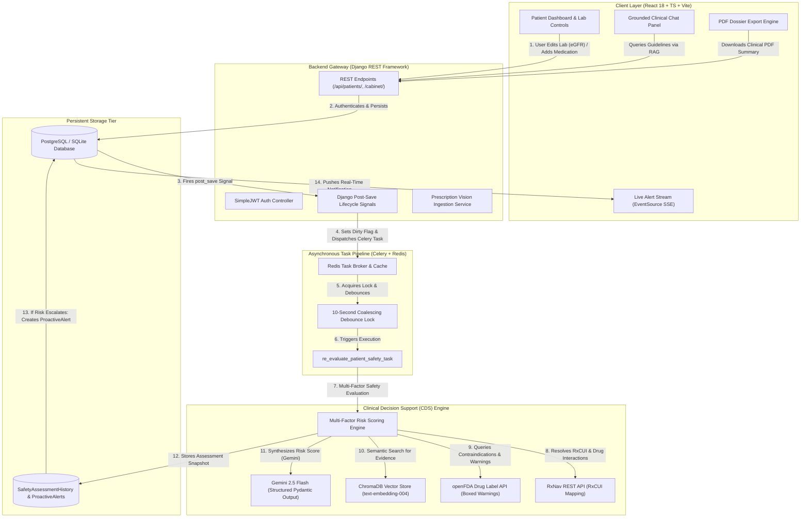
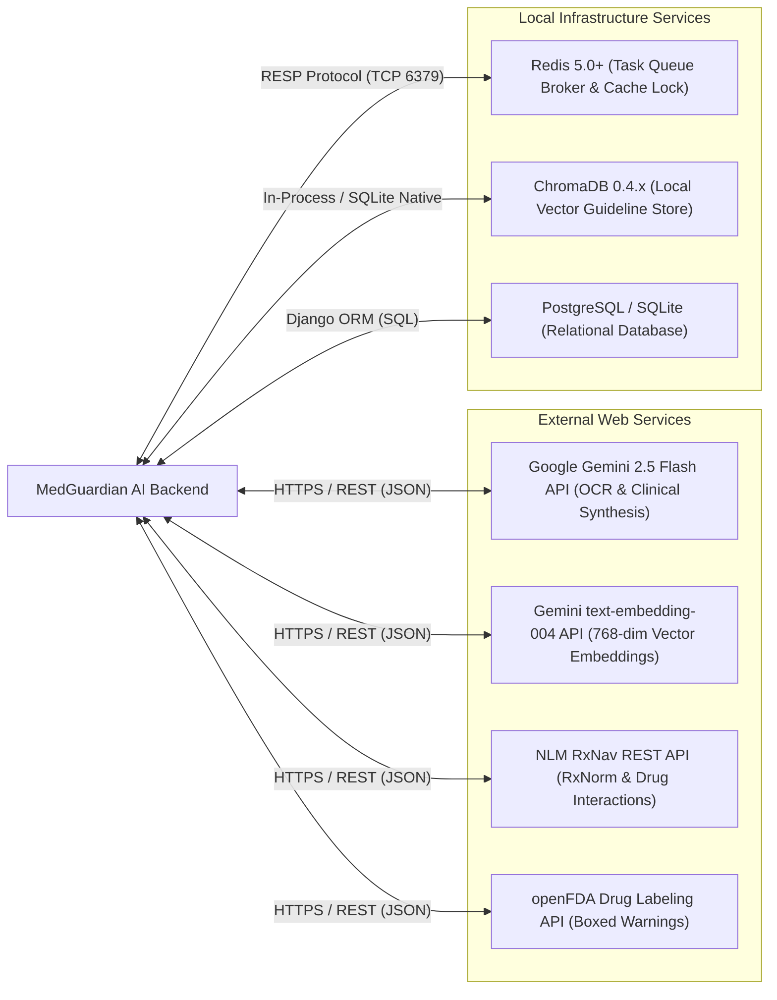

<style>
body {
    font-family: -apple-system, BlinkMacSystemFont, "Segoe UI", Roboto, Helvetica, Arial, sans-serif;
    font-size: 11pt !important;
    line-height: 1.6 !important;
    color: #1f2937 !important;
}
h1, h2, h3, h4, h5, h6 {
    page-break-after: avoid !important;
    break-after: avoid !important;
    color: #111827 !important;
}
.page-break {
    page-break-before: always !important;
    break-before: always !important;
}
blockquote {
    font-style: italic !important;
    border-left: 4px solid #3b82f6 !important;
    padding-left: 1em !important;
    margin: 1.5em 0 !important;
    color: #374151 !important;
    background-color: #f8fafc;
    padding: 0.75em 1em;
    border-radius: 0 6px 6px 0;
}
table {
    width: 100%;
    border-collapse: collapse;
    margin: 1.5em 0;
    font-size: 10pt;
}
th, td {
    border: 1px solid #cbd5e1;
    padding: 8px 12px;
    text-align: left;
}
th {
    background-color: #f1f5f9;
    font-weight: 600;
    color: #0f172a;
}
tr:nth-child(even) {
    background-color: #f8fafc;
}
code {
    background-color: #f1f5f9;
    padding: 2px 5px;
    border-radius: 4px;
    font-size: 9pt;
    font-family: ui-monospace, SFMono-Regular, Menlo, Monaco, Consolas, monospace;
}
pre code {
    background-color: transparent;
    padding: 0;
}
.badge {
    display: inline-block;
    padding: 2px 8px;
    border-radius: 9999px;
    font-size: 8pt;
    font-weight: bold;
    text-transform: uppercase;
}
.badge-severe { background-color: #fee2e2; color: #991b1b; }
.badge-moderate { background-color: #fef3c7; color: #92400e; }
.badge-low { background-color: #e0f2fe; color: #075985; }
.badge-safe { background-color: #dcfce7; color: #166534; }
</style>

# 📑 Practical Record / Laboratory Assignment
## Software Engineering & System Architecture Laboratory

---

| Academic Metadata | Information |
| :--- | :--- |
| **Practical Title** | **Preparation of Software Requirement Specification (SRS) document by clearly specifying all functional and non-functional requirements.** |
| **System / Project Name** | **MedGuardian AI — Proactive Medication Digital Twin** |
| **Author / Candidate** | **Taranpreet Kaur** |
| **Document Standard** | **IEEE Std 830-1998 / ISO/IEC/IEEE 29148:2018 Standard for SRS** |
| **Document Version** | **1.0 (Final Release)** |
| **Target Domain** | Clinical Decision Support (CDS) & Proactive Medication Safety Monitoring |

---

<div class="page-break"></div>

# Table of Contents
1. [Aim & Practical Objectives](#1-aim--practical-objectives)
2. [Section 1: Introduction to the SRS](#2-section-1-introduction-to-the-srs)
   - 1.1 Purpose of the Document
   - 1.2 Document Conventions
   - 1.3 Intended Audience and Reading Suggestions
   - 1.4 Project Scope & Clinical Domain Background
   - 1.5 Definitions, Acronyms, and Abbreviations
   - 1.6 References
3. [Section 2: Overall System Description](#3-section-2-overall-system-description)
   - 2.1 Product Perspective & Digital Twin Architecture
   - 2.2 System Architecture Diagram
   - 2.3 User Classes and Characteristics
   - 2.4 Operating Environment & Technology Stack
   - 2.5 Design and Implementation Constraints
   - 2.6 User Documentation
   - 2.7 Assumptions and Dependencies
4. [Section 3: Comprehensive Functional Requirements (FRs)](#4-section-3-comprehensive-functional-requirements-frs)
   - Module 1: Patient Identity & Profile Tracking (FR-01, FR-02)
   - Module 2: Multimodal Prescription Ingestion (FR-03)
   - Module 3: Digital Medication Cabinet (FR-04)
   - Module 4: Standardized Drug Resolution & Interaction Auditing (FR-05, FR-06)
   - Module 5: Retrieval-Augmented Generation (RAG) Evidence Engine (FR-07)
   - Module 6: Asynchronous Event Pipeline & Debounced Execution (FR-08)
   - Module 7: Proactive Escalating Alert System (FR-09, FR-10)
   - Module 8: Live Real-Time Alert Streaming via SSE (FR-11)
   - Module 9: Grounded Clinical Chatbot (FR-12)
   - Module 10: Dual-Audience Clinical PDF Dossier Generation (FR-13)
5. [Section 4: Detailed Non-Functional Requirements (NFRs)](#5-section-4-detailed-non-functional-requirements-nfrs)
   - 4.1 Performance Requirements
   - 4.2 Reliability, Fault Tolerance & Fail-Open Invariants
   - 4.3 System Availability
   - 4.4 Security, Confidentiality & HIPAA PHI Protection
   - 4.5 Clinical Safety, Determinism & AI Groundedness
   - 4.6 Usability, Ergonomics & Accessibility
   - 4.7 Maintainability, Modularity & Portability
   - 4.8 Scalability & Concurrency Control
6. [Section 5: External Interface Requirements](#6-section-5-external-interface-requirements)
   - 5.1 User Interfaces (UI/UX)
   - 5.2 Hardware Interfaces
   - 5.3 Software Interfaces
   - 5.4 Communications Interfaces
7. [Section 6: Use Case Models & Behavioral Specifications](#7-section-6-use-case-models--behavioral-specifications)
   - 6.1 Primary Actor Profiles
   - 6.2 Use Case Scenarios
   - 6.3 Requirements Traceability Matrix (RTM)
8. [Section 7: System Hardware & Software Configuration](#8-section-7-system-hardware--software-configuration)
9. [Section 8: Verification Checklist & Practical Viva Evaluation](#9-section-8-verification-checklist--practical-viva-evaluation)
10. [Section 9: Conclusion & Learning Outcomes](#10-section-9-conclusion--learning-outcomes)

---

<div class="page-break"></div>

# 1. Aim & Practical Objectives

### Aim:
To prepare a formal, comprehensive, and industry-standard **Software Requirement Specification (SRS)** document for **MedGuardian AI**, clearly identifying, defining, categorizing, and validating all **functional requirements (FRs)** and **non-functional requirements (NFRs)** in adherence with the **IEEE Std 830-1998** / **ISO/IEC/IEEE 29148:2018** standards.

### Practical Objectives:
1. **Requirement Elicitation**: Analyze the real-world healthcare crisis of polypharmacy and adverse drug reactions (ADRs) to formulate software requirements for an autonomous "Medication Digital Twin."
2. **Functional Specification**: Formulate granular specifications covering user authentication, multimodal prescription OCR, drug-drug interaction auditing, RAG-grounded risk scoring, debounced Celery pipelines, proactive alert generation, and live streaming.
3. **Non-Functional Specification**: Establish quantifiable, verifiable benchmarks for latency, fail-open resilience, clinical safety invariants, HIPAA-aligned data segregation, and zero-hallucination thresholds.
4. **Interface Specification**: Formulate software and communications interfaces across modern client-server architectures, including RESTful endpoints, Server-Sent Events (SSE), external clinical databases (NLM RxNav, openFDA), and generative foundation models (Gemini 2.5 Flash).
5. **Traceability and Verification**: Map requirements to use cases, architectural components, and acceptance test cases via a Requirements Traceability Matrix (RTM).

---

# 2. Section 1: Introduction to the SRS

## 1.1 Purpose of the Document
This Software Requirement Specification (SRS) document details the complete functional, non-functional, behavioral, and architectural requirements for the **MedGuardian AI** platform. It provides a formal contract between clinical stakeholders, software architects, engineering teams, and quality assurance personnel. It serves as the baseline for system implementation, testing, verification, and regulatory compliance auditing.

## 1.2 Document Conventions
This document adheres to the IEEE 830-1998 standard format. Requirements are uniquely identified using the following naming conventions:
- `FR-[XX]`: Functional Requirement number `XX`
- `NFR-[CATEGORY]-[XX]`: Non-Functional Requirement (e.g., `NFR-PERF-01`, `NFR-SEC-02`, `NFR-SAFE-01`)
- `UC-[XX]`: Use Case specification number `XX`
- Priority is classified as: **High (Core/Mandatory)**, **Medium (Essential/Standard)**, or **Low (Desirable/Enhancement)**.

## 1.3 Intended Audience and Reading Suggestions
- **Software Developers & Engineers**: Review Section 2, Section 3, and Section 5 for implementation specifications, schema rules, and API integrations.
- **System Architects & DevOps**: Review Section 2.2, Section 4.1, 4.2, 4.8, and Section 7 for task queue architectures, concurrency locks, and containerization.
- **Clinical Reviewers & Medical Advisors**: Review Section 1.4, Section 3 (Risk Engine & RAG), and Section 4.5 for clinical invariants and safety mechanisms.
- **QA & Test Engineers**: Review Section 6 (Use Cases and RTM) and Section 8 (Verification & Acceptance Criteria).

## 1.4 Project Scope & Clinical Domain Background
Medication errors and adverse drug reactions (ADRs) represent a catastrophic, preventable cause of patient morbidity and mortality globally. 

> **World Health Organization (WHO) Evidence Baseline:**
> - **Global Patient Harm**: Approximately **1 in every 10 patients** experiences harm while receiving medical care; more than **3 million deaths** occur annually due to unsafe clinical practices.
> - **Preventable Medication Harm**: Over **50% of healthcare harm** is preventable, and **half of all preventable harm** is directly attributable to medications.
> - **Prescribing Stage Vulnerabilities**: Approximately **53% of preventable medication harm** originates during the initial prescription stage, escalating to nearly **80%** in resource-constrained environments.
> - **Economic Impact**: Unsafe medication practices incur an estimated global healthcare cost of **$42 Billion USD annually**.

Modern healthcare is plagued by **polypharmacy** (the concurrent administration of five or more medications, prevalent among elderly patients and those with multiple chronic morbidities). Current clinical decision support (CDS) solutions are static and episodic—they only check for conflicts at the exact moment a doctor issues an e-prescription. 

**MedGuardian AI** introduces the paradigm of a **Proactive Medication Digital Twin**. It continuously mirrors a patient's evolving physiological state (renal filtration rate eGFR, serum creatinine, onset of pregnancy, newly documented allergies) and active drug regimens. Instead of requiring manual re-queries, the system automatically audits the patient's holistic safety profile in the background whenever any clinical variable updates, proactively notifying patients and treating physicians before organ failure or acute drug toxicity occurs.

## 1.5 Definitions, Acronyms, and Abbreviations

| Term / Acronym | Full Definition | Clinical / Technical Context in MedGuardian AI |
| :--- | :--- | :--- |
| **ADR** | Adverse Drug Reaction | An unwanted, harmful reaction experienced following administration of a medication. |
| **CDS** | Clinical Decision Support | Automated logic providing clinicians with knowledge and person-specific information. |
| **Digital Twin** | Virtual Physiological Mirror | A real-time computational counterpart of a patient's medication regimen and vitals. |
| **eGFR** | Estimated Glomerular Filtration Rate | Key renal function biomarker measured in $mL/min/1.73m^2$; crucial for drug dosage adjustment. |
| **HIPAA** | Health Insurance Portability and Accountability Act | United States healthcare law mandating strict data privacy and security for PHI. |
| **JWT** | JSON Web Token | Stateless cryptographic token standard (`RFC 7519`) used for authenticated API sessions. |
| **NER** | Named Entity Recognition | Natural language processing extraction of clinical entities (drug, strength, frequency). |
| **NLM RxNav** | National Library of Medicine RxNav API | Authoritative API mapping medications to RxNorm identifiers and known drug-drug interactions. |
| **OCR** | Optical Character Recognition | Vision-based conversion of printed/handwritten prescription images into machine text. |
| **openFDA** | US Food & Drug Administration API | Official repository providing access to structured drug warning labels, boxed warnings, and recalls. |
| **PHI** | Protected Health Information | Individually identifiable health information requiring database segregation. |
| **RAG** | Retrieval-Augmented Generation | AI framework combining vector database retrieval (ChromaDB) with LLM synthesis. |
| **RxCUI** | RxNorm Concept Unique Identifier | Standardized numeric identifier assigned to distinct clinical drug formulations. |
| **SSE** | Server-Sent Events | Unidirectional real-time HTTP streaming (`text/event-stream`) pushing alerts to the client UI. |

## 1.6 References
1. **IEEE Std 830-1998**: *IEEE Recommended Practice for Software Requirements Specifications*.
2. **ISO/IEC/IEEE 29148:2018**: *Systems and software engineering — Life cycle processes — Requirements engineering*.
3. **World Health Organization**: *Global Patient Safety Action Plan 2021–2030: Towards eliminating avoidable harm in health care (2024)*.
4. **National Library of Medicine (NLM)**: *RxNorm & RxNav RESTful API Documentation*.
5. **U.S. Food & Drug Administration (FDA)**: *openFDA Drug Product Labeling API Specification*.

---

<div class="page-break"></div>

# 3. Section 2: Overall System Description

## 2.1 Product Perspective & Digital Twin Architecture
MedGuardian AI is a distributed, full-stack, event-driven web platform. It operates through three decoupled tiers:
1. **Presentation Tier (SPA)**: A reactive Single-Page Application (React 18, Vite 8, TypeScript, Tailwind CSS) providing patient dashboards, camera upload interfaces, real-time alert streams, and clinical chat.
2. **Application & Orchestration Tier (DRF + Celery + Redis)**: A Django REST Framework service that serves stateless REST APIs, triggers asynchronous signals, manages cache-based concurrency debouncing, and orchestrates Celery worker pools.
3. **Intelligence & Evidence Tier (Vector Store + External APIs)**: ChromaDB vector database executing dense embeddings (`text-embedding-004`), Google Gemini 2.5 Flash executing structured OCR and clinical synthesis, and authoritative federal APIs (NLM RxNav, openFDA).

### Core Architectural Invariant:
> **Clinical Safety Fail-Open Rule**: If secondary caching layers (Redis) or external generative models experience downtime, MedGuardian AI must **never** drop a patient safety assessment. The system must fail-open to execute evaluation via local rule-based interaction tables and local TF-IDF evidence search.

## 2.2 System Architecture Diagram



## 2.3 User Classes and Characteristics

| User Role | Profile Description | Technical Proficiency | Key Needs & System Permissions |
| :--- | :--- | :--- | :--- |
| **Patient / Chronic Sufferer** | Individuals managing polypharmacy, chronic hypertension, diabetes, or renal disease. | Novice to Intermediate | Simple UI, high-contrast text, plain-language drug safety summaries, instant alerts upon lab changes. |
| **Caregiver / Family Member** | Individuals monitoring health profiles and cabinet regimens for elderly or dependent family members. | Intermediate | Ability to upload prescription scans, log newly observed symptoms/allergies, and review safety history. |
| **Attending Physician / Clinician** | Licensed medical practitioners seeking clinical verification and drug-drug conflict audits. | Advanced | High-density clinical dossier exports, pharmacological mechanism breakdowns, exact clinical guideline citations, and lab threshold contraindication warnings. |
| **System Administrator** | Engineering and operations staff managing server uptime, vector indexes, and API keys. | Expert | Management commands for ChromaDB indexing, Celery worker monitoring, Redis cache health, and audit trail inspection. |

## 2.4 Operating Environment & Technology Stack
- **Operating Systems Supported**: Cross-platform (Windows 10/11, macOS 12+, Linux Ubuntu 20.04+ LTS).
- **Backend Framework**: Python 3.10+, Django 4.2.x, Django REST Framework 3.14.x.
- **Asynchronous Processing**: Celery 5.3.x, Redis 5.0.0+ (as message broker and atomic cache lock).
- **Vector Database**: ChromaDB 0.4.24 (hosting clinical guidelines embeddings).
- **Generative AI & Embeddings**: Google GenAI SDK (`gemini-2.5-flash`, `text-embedding-004`).
- **External Clinical Web Services**: NLM RxNav REST API, openFDA Drug Labeling API.
- **Frontend Environment**: React 18, Vite 8, TypeScript 5.x, Tailwind CSS 3.4.x, Recharts 2.x, Lucide React.
- **Reporting Engine**: ReportLab 4.0.8 (dynamic PDF vector document generation).

## 2.5 Design and Implementation Constraints
1. **Clinical Regulatory & Privacy Constraints (HIPAA Compliance)**:
   - Patient Health Information (PHI) must be strictly isolated per user account. Database schemas must enforce foreign key relations tying every health record, cabinet item, and safety log strictly to the authenticated `PatientProfile`.
   - Passwords must be hashed using cryptographic algorithms (PBKDF2 with SHA-256).
2. **AI Safety & Hallucination Prevention Constraints**:
   - The system must **never** generate fabricated clinical recommendations. Generative evaluations must be strictly grounded in context chunks retrieved from ChromaDB guidelines or federal APIs.
   - If evidence is absent, the clinical chat engine must return a deterministic refusal rather than guessing.
3. **Idempotency & Concurrency Constraints**:
   - Rapid consecutive modifications to patient records (e.g., rapid slider adjustments on eGFR or multi-drug additions) must be collapsed via a **10-second trailing-edge debounce lock** in Redis to prevent worker exhaustion.
4. **External API Rate Limiting & Latency**:
   - Network timeouts to external services (NLM, openFDA, Google Gemini) must not exceed 4 seconds. Exponential backoff retries (maximum 3 attempts) are mandatory.

## 2.6 User Documentation
- Interactive online documentation and API specification via OpenAPI/Swagger schemas.
- In-app visual tooltips explaining complex medical terms (such as eGFR, creatinine clearance, and hyperkalemia).
- Exportable, self-contained PDF user summaries for non-technical patients.

## 2.7 Assumptions and Dependencies
- **Network Access**: High-speed internet connectivity is assumed for querying NLM RxNav, openFDA, and Gemini models. (Offline mode operates via local fallback rule tables).
- **Legibility of Prescriptions**: Uploaded images must have a minimum resolution of 72 DPI and sufficient contrast for optical text recognition.
- **Guideline Database**: The local ChromaDB vector store is populated with verified clinical PDF/TXT guideline documents.

---

<div class="page-break"></div>

# 4. Section 3: Comprehensive Functional Requirements (FRs)

The functional requirements are systematically partitioned into ten functional modules representing the end-to-end lifecycle of the MedGuardian AI platform.

---

### Module 1: Patient Identity & Profile Tracking

#### `FR-01`: User Authentication & Role-Based Access Control
- **Description**: The system shall provide secure user registration, credential authentication, and stateless session management using JSON Web Tokens (SimpleJWT).
- **Trigger / Input**: User submits username and password via the client login/registration interface.
- **Processing**:
  1. Validate password complexity (minimum 8 characters, non-common).
  2. Authenticate credentials against PBKDF2-hashed Django `auth_user` database table.
  3. Generate a cryptographic JWT token pair: Access Token (15-minute validity) and Refresh Token (7-day validity).
  4. Automatically create an associated `PatientProfile` record upon new user registration.
- **Output**: JSON payload containing `access`, `refresh`, and user profile identifiers.
- **Acceptance Criteria**: Unauthenticated requests to protected endpoints (`/api/patients/*`) must return HTTP 401 Unauthorized.

#### `FR-02`: Patient Health Profile & Renal Biomarker Management
- **Description**: The system shall permit users and clinicians to record, update, and validate physical demographics and critical organ function biomarkers.
- **Trigger / Input**: User inputs age, biological gender (`M`, `F`, `O`), pregnancy status (`boolean`), chronic conditions (`JSON list`), allergies (`JSON list`), serum creatinine ($mg/dL$), and eGFR ($mL/min/1.73m^2$).
- **Processing**:
  1. Execute server-side domain validation rules:
     - $Age \le 125$ and $Age \ge 0$.
     - $Creatinine \ge 0.0$ and $eGFR \ge 0.0$.
     - **Biological Invariant Validation**: If $Gender == 'M'$, $pregnancy\_status$ must not be set to `true`. Violations raise a Django `ValidationError`.
  2. Persist updated values into the `PatientProfile` model.
  3. Emit a `post_save` model lifecycle signal.
- **Output**: HTTP 200 OK with validated profile JSON object; dispatch of background evaluation signal.
- **Acceptance Criteria**: Submitting a negative eGFR or male pregnancy status must be rejected with HTTP 400 and explicit field validation errors.

---

### Module 2: Multimodal Prescription Ingestion

#### `FR-03`: Visual Prescription Upload & Multimodal OCR/NER
- **Description**: The system shall accept image files of medical prescriptions, perform optical parsing, extract clinical medication entities, and return structured JSON schemas.
- **Trigger / Input**: User uploads prescription scan (PNG, JPEG, WEBP) via the web interface.
- **Processing**:
  1. Upload image to secure media storage and instantiate a `Prescription` database record with `processed=False`.
  2. Send raw image bytes to Google Gemini 2.5 Flash using the `google-genai` SDK.
  3. Supply a deterministic system prompt enforcing a strict Pydantic schema (`ExtractionResult` containing `medications`: list of `name`, `dosage`, `frequency`).
  4. Parse the returned structured JSON and update `Prescription.structured_data`.
  5. **Offline Fallback Engine**: If `GEMINI_API_KEY` is absent or times out, execute a rule-based mock parser extracting standard sample regimens (e.g., Lisinopril, Metformin).
  6. Set `Prescription.processed = True` and trigger downstream safety assessment.
- **Output**: Structured JSON list of extracted drug names, strengths, and regimens displayed in an interactive review modal.
- **Acceptance Criteria**: Prescriptions containing handwritten or typed text must be parsed into valid medication entities within 5 seconds under normal network conditions.

---

### Module 3: Digital Medication Cabinet

#### `FR-04`: Active Medication Cabinet Management
- **Description**: The system shall maintain an active digital inventory of all medications currently consumed by the patient.
- **Trigger / Input**: User confirms extracted prescription items or manually adds, edits, or deactivates a drug record.
- **Processing**:
  1. Record medication attributes: `name` (string), `dosage` (string), `frequency` (string), `start_date` (Date), `end_date` (Optional Date), `is_active` (boolean).
  2. Normalize drug names (trim whitespace, lowercasing).
  3. Upon save or deletion, fire Django `post_save` or `post_delete` signals targeting the patient's safety pipeline.
- **Output**: Updated `MedicationCabinet` record; dispatch of background re-evaluation task.
- **Acceptance Criteria**: Deactivating a drug (`is_active = False`) must immediately update the active cabinet and trigger safety re-assessment without deleting historical records.

---

### Module 4: Standardized Drug Resolution & Interaction Auditing

#### `FR-05`: RxNorm Concept Resolution & RxNav Interaction Queries
- **Description**: The system shall map brand/generic medication names to authoritative RxNorm Concept Unique Identifiers (RxCUIs) and audit drug combinations for known clinical interactions.
- **Trigger / Input**: Array of active medication name strings passed to `RiskEngine`.
- **Processing**:
  1. For each drug, query the NLM RxNav API: `https://rxnav.nlm.nih.gov/REST/rxcui.json?name={drug_name}`.
  2. Extract primary RxCUI code (e.g., Lisinopril $\rightarrow$ `29046`, Spironolactone $\rightarrow$ `9997`).
  3. Formulate multi-drug interaction query: `https://rxnav.nlm.nih.gov/REST/interaction/list.json?rxcuis={cui_1}+{cui_2}`.
  4. Parse hierarchical JSON response (`fullInteractionTypeGroup` $\rightarrow$ `interactionPair`).
  5. **Offline Interaction Fallback**: If RxNav is unavailable, query internal `FALLBACK_INTERACTIONS` dictionary (e.g., checking for Lisinopril + Spironolactone hyperkalemia risk, Lisinopril + Ibuprofen renal deterioration, Metformin + Contrast lactic acidosis).
- **Output**: List of identified drug pairs, clinical severity flags (`Severe`, `Moderate`, `Low`), and clinical description texts.
- **Acceptance Criteria**: Known fatal combinations (e.g., ACE Inhibitors + Potassium-Sparing Diuretics) must consistently register a `Severe` interaction warning.

#### `FR-06`: openFDA Black Box Warning & Precaution Retrieval
- **Description**: The system shall query the official FDA regulatory database to extract official drug labeling warnings, contraindications, and boxed warnings.
- **Trigger / Input**: Resolved drug name.
- **Processing**:
  1. Issue REST GET request to `https://api.fda.gov/drug/label.json?search=openfda.generic_name:"{drug_name}"&limit=1`.
  2. Extract `boxed_warning`, `warnings_and_cautions`, and `contraindications` text fields.
  3. Cache retrieved label excerpts locally to minimize redundant external network queries.
- **Output**: Array of regulatory precautions relevant to the patient's active regimen.
- **Acceptance Criteria**: Black-box warnings (e.g., ACE-inhibitor fetal toxicity in pregnancy) must be successfully fetched and injected into the evaluation context.

---

### Module 5: Retrieval-Augmented Generation (RAG) Evidence Engine

#### `FR-07`: Vector Guideline Embedding & Contextual Retrieval
- **Description**: The system shall index certified clinical practice guidelines in a local vector database and perform semantic similarity searches for patient-specific clinical queries.
- **Trigger / Input**: Patient clinical state summary (conditions, renal metrics, medications) or user chat query.
- **Processing**:
  1. **Indexing Stage**: Management command `python manage.py index_guidelines` reads PDF/TXT guideline files from `backend/data/`, splits text into 1,000-character chunks with 200-character overlap, generates 768-dimensional dense vector embeddings using Gemini `text-embedding-004`, and indexes them in a persistent local `ChromaDB` collection.
  2. **Retrieval Stage**: Convert input query to an embedding vector; execute top-$k$ ($k=4$) cosine similarity search against ChromaDB.
  3. **Keyword Fallback**: If vector generation is offline, execute a localized BM25/TF-IDF keyword ranking search over the guideline text chunks.
- **Output**: Ranked list of guideline text excerpts with metadata citations (document title, page/chunk ID).
- **Acceptance Criteria**: Retrieval queries regarding "kidney impairment with metformin" must return KDIGO guideline excerpts advising dose reduction when eGFR $< 45$ and discontinuation when eGFR $< 30$.

---

### Module 6: Asynchronous Event Pipeline & Debounced Execution

#### `FR-08`: Event-Driven Triggering & Trailing-Edge Coalescing Debounce
- **Description**: The system shall asynchronously execute safety assessments in response to database changes while debouncing rapid consecutive edits into a single execution run.
- **Trigger / Input**: Any `post_save` or `post_delete` event on `PatientProfile`, `MedicationCabinet`, or `Prescription`.
- **Processing**:
  1. Lifecycle signal sets a Redis dirty flag key: `patient_safety_dirty_{patient_id}` with a 120-second TTL.
  2. Signal issues Celery task: `re_evaluate_patient_safety_task.delay(patient_id, triggered_by)`.
  3. **Concurrency Lock Acquisition**: Celery worker attempts to acquire an atomic execution lock in Redis: `cache.add(patient_safety_running_{patient_id}, 1, timeout=60)`.
  4. If the lock is already held by an active task, the newly arrived task records that the dirty flag is set and safely exits immediately (`coalesced=True`).
  5. **Trailing-Edge Loop**: The running task clears the dirty flag, loads a fresh database snapshot, executes the complete risk analysis, and upon completion checks if the dirty flag was re-asserted while it was running. If dirty, it immediately loops and re-evaluates the final state before releasing the lock.
  6. **Fail-Open Resilience**: If Redis is unreachable, the task logs a warning and fails open, executing the safety check directly to preserve patient safety.
- **Output**: Atomic execution log; guaranteed evaluation of the patient's true final state; zero duplicate Celery runs.
- **Acceptance Criteria**: When a user rapidly edits five medication dosages within 3 seconds, exactly one comprehensive evaluation of the final state must run after the rapid edits cease.

---

### Module 7: Proactive Escalating Alert System

#### `FR-09`: Comparative Risk Auditing & Alert Generation
- **Description**: The system shall compare newly generated risk scores with historical assessments and generate persistent, high-visibility alerts if the patient's risk level has worsened.
- **Trigger / Input**: Output of `re_evaluate_patient_safety_task`.
- **Processing**:
  1. Retrieve latest `SafetyAssessmentHistory` record for the patient.
  2. Determine numeric rank of current and previous risk scores using the severity mapping:
     $$\text{RISK\_ORDER} = \{\text{'Safe'}: 0, \text{'Low'}: 1, \text{'Moderate'}: 2, \text{'Severe'}: 3\}$$
  3. Calculate risk differential: $\Delta_{\text{risk}} = \text{Rank}(\text{Risk}_{\text{new}}) - \text{Rank}(\text{Risk}_{\text{prev}})$.
  4. If $\Delta_{\text{risk}} > 0$ (e.g., status shifted from `Safe` $\rightarrow$ `Moderate` or `Moderate` $\rightarrow$ `Severe`):
     - Instantiate a new `ProactiveAlert` model instance with `severity = Risk_{\text{new}}`, `acknowledged = False`, timestamp, and clinical explanation.
  5. Persist the new assessment into `SafetyAssessmentHistory`.
- **Output**: Persisted `SafetyAssessmentHistory` record; new unacknowledged `ProactiveAlert` record in the database.
- **Acceptance Criteria**: If an eGFR drop causes the risk tier to jump from `Low` to `Severe`, a `ProactiveAlert` with severity `Severe` must be created within 10 seconds of the lab change.

#### `FR-10`: Alert Acknowledgment Management
- **Description**: The system shall allow users or clinicians to review and mark proactive alerts as acknowledged.
- **Trigger / Input**: User clicks "Acknowledge Alert" button (`PATCH /api/patients/alerts/{id}/acknowledge/`).
- **Processing**: Set `ProactiveAlert.acknowledged = True`; update database record.
- **Output**: HTTP 200 OK; alert visual status transitions from flashing warning to archived in client UI.
- **Acceptance Criteria**: Acknowledged alerts must no longer trigger unread notification indicators in the UI header.

---

### Module 8: Live Real-Time Alert Streaming (SSE)

#### `FR-11`: Server-Sent Events (SSE) Live Notification Stream
- **Description**: The system shall maintain an open, unidirectional HTTP event stream pushing newly generated alerts to connected client web browsers instantly without polling.
- **Trigger / Input**: Client opens an HTTP connection to `/api/patients/alerts/stream/` with a valid JWT.
- **Processing**:
  1. Verify client authorization.
  2. Return HTTP response with `Content-Type: text/event-stream`, `Cache-Control: no-cache`, `Connection: keep-alive`.
  3. Keep the streaming generator open; upon creation of a new unacknowledged `ProactiveAlert` for the authenticated patient, format payload as:
     ```
     event: proactive_alert
     data: {"id": 14, "severity": "Severe", "message": "Critical hyperkalemia risk detected.", "created_at": "..."}
     ```
  4. Send periodic heartbeat pings (`: ping\n\n`) every 15 seconds to prevent gateway timeouts.
  5. **Client Fallback**: If the SSE connection drops or is blocked by an intermediary proxy, the frontend `useAlerts` hook must automatically fall back to standard REST HTTP polling every 10 seconds.
- **Output**: Real-time push notification delivered to active client dashboard within 500ms of alert creation.
- **Acceptance Criteria**: When an alert is saved in the backend, the client dashboard banner must update automatically without the user manually refreshing the browser.

---

### Module 9: Grounded Clinical Chatbot

#### `FR-12`: Evidence-Grounded Conversational Assistant
- **Description**: The system shall provide an interactive conversational chat panel allowing patients and clinicians to ask questions regarding their medications, with answers strictly synthesized from retrieved medical evidence.
- **Trigger / Input**: Natural language prompt submitted by user (e.g., *"Why is taking ibuprofen bad with my lisinopril?"*).
- **Processing**:
  1. Retrieve active patient profile (age, eGFR, pregnancy, conditions) and cabinet medications.
  2. Perform semantic search over ChromaDB guidelines using the query text to obtain top evidence passages.
  3. Construct a bounded Gemini system prompt:
     - Inject active patient context.
     - Inject retrieved guideline passages.
     - **Strict Hallucination Boundary**: *"You are a clinical safety assistant. You must answer strictly and solely using the provided clinical guideline context. If the answer cannot be determined from the provided context, state clearly that you do not have sufficient medical evidence and advise consulting a physician."*
  4. Stream or return the synthesized explanation.
- **Output**: Natural language clinical response citing specific guidelines and active medications.
- **Acceptance Criteria**: Queries about unrelated topics (e.g., *"Write a Python script"* or ungrounded medical queries) must be politely declined, directing the user to professional clinical staff.

---

### Module 10: Dual-Audience Clinical PDF Dossier Generation

#### `FR-13`: Dynamic ReportLab PDF Document Compilation
- **Description**: The system shall dynamically compile and render publication-quality PDF documents tailored to two distinct audiences: a plain-language summary for patients and a high-density clinical dossier for physicians.
- **Trigger / Input**: User requests `/api/patients/reports/patient-summary/` or `/api/patients/reports/clinician-dossier/`.
- **Processing**:
  1. Query active patient profile, complete medication cabinet, and latest `SafetyAssessmentHistory`.
  2. Initialize ReportLab `SimpleDocTemplate` with custom canvas headers, footers, page numbering, and clean typography.
  3. **Patient Safety Summary**:
     - Render active medication schedule table (Medication, Dosage, Frequency, Purpose).
     - Render plain-language safety precautions and dietary warnings (e.g., avoid high potassium foods).
  4. **Clinician Safety Dossier**:
     - Render formal demographic and biomarker audit box (Creatinine, eGFR staging, renal impairment risk).
     - Render detailed pharmacological drug interaction matrix with NLM and openFDA warnings.
     - Include exact evidence guideline citations, mechanism descriptions, and physician signature block.
- **Output**: Binary PDF byte stream returned with `Content-Type: application/pdf` and `Content-Disposition: attachment`.
- **Acceptance Criteria**: The generated PDF must be fully self-contained, render correctly in all standard PDF viewers, and compile within 2.5 seconds.

---

<div class="page-break"></div>

# 5. Section 4: Detailed Non-Functional Requirements (NFRs)

Non-functional requirements specify the quality attributes, operational limits, safety boundaries, and design standards that the MedGuardian AI system must satisfy.

---

## 4.1 Performance Requirements

| Req ID | Parameter | Metric / Benchmark | Operational Rationale |
| :--- | :--- | :--- | :--- |
| **`NFR-PERF-01`** | **Debounce Window** | **$10\text{ seconds}$** | Collapses rapid consecutive profile/cabinet edits into a single execution run to prevent worker saturation. |
| **`NFR-PERF-02`** | **Prescription OCR Processing** | **$\le 4.0\text{ seconds}$** | Gemini 2.5 Flash multimodal parsing must extract medication entities from a 2MB image within 4 seconds. |
| **`NFR-PERF-03`** | **RAG Vector Search Latency** | **$\le 250\text{ milliseconds}$** | ChromaDB cosine similarity search against indexed guideline embeddings must return top-$4$ chunks within 250ms. |
| **`NFR-PERF-04`** | **End-to-End Safety Assessment** | **$\le 5.0\text{ seconds}$** | Background Celery evaluation (RxNav query + openFDA + RAG + synthesis) must complete within 5 seconds under nominal network conditions. |
| **`NFR-PERF-05`** | **Live Alert Push Latency** | **$\le 500\text{ milliseconds}$** | Newly persisted `ProactiveAlert` must reach connected browser SSE streams within 500ms of database commit. |
| **`NFR-PERF-06`** | **PDF Dossier Generation** | **$\le 2.5\text{ seconds}$** | ReportLab dynamic compilation of a multi-page clinical dossier must complete within 2.5 seconds. |

---

## 4.2 Reliability, Fault Tolerance & Fail-Open Invariants

#### `NFR-REL-01`: External API Exponential Backoff Retry
- If external web services (Google Gemini API, NLM RxNav, openFDA) fail to respond or return HTTP 5xx / timeout errors, the calling service and Celery task must automatically retry up to **3 times** with exponential backoff delays ($5\text{s} \rightarrow 10\text{s} \rightarrow 20\text{s}$).

#### `NFR-REL-02`: Clinical Safety Fail-Open Invariant
- **Fundamental Healthcare Requirement**: Under no circumstances shall an operational failure in the Redis caching layer or Celery task broker cause a safety evaluation to be silently skipped or dropped.
- If Redis is unreachable during atomic lock acquisition, the system must log an error and immediately **fail open** (execute the safety evaluation directly in the thread/process) to ensure patient risk is evaluated.

#### `NFR-REL-03`: Offline Fallback Execution Capability
- If internet connectivity is interrupted or API keys are unavailable:
  1. The prescription ingestion pipeline must fallback to the internal rule-based mock extractor.
  2. The risk engine must fallback to the local `FALLBACK_INTERACTIONS` knowledge base.
  3. The RAG engine must fallback from vector similarity to local TF-IDF keyword search over stored guideline texts.

---

## 4.3 System Availability

#### `NFR-AVB-01`: Operational Uptime
- The MedGuardian AI service core shall maintain a minimum operational availability of **99.9%** during scheduled operational hours, excluding pre-announced maintenance windows.

#### `NFR-AVB-02`: Redis Lease Expiration & Crash Recovery
- Execution locks stored in Redis (`patient_safety_running_{id}`) must possess a strict Time-To-Live (TTL) lease of **60 seconds**. In the event of a catastrophic Celery worker thread crash or host reboot, the lock must expire automatically within 60 seconds, preventing permanent deadlock.

---

## 4.4 Security, Confidentiality & HIPAA PHI Protection

#### `NFR-SEC-01`: Protected Health Information (PHI) Data Isolation
- In accordance with the HIPAA Security Rule, patient medical data, laboratory metrics, prescription images, and safety logs must be strictly isolated at the database level. Queries must enforce multi-tenant isolation scoped to `request.user.profile`.

#### `NFR-SEC-02`: Cryptographic Communication & Storage
- All network communications between the client browser, backend API, and external services must be encrypted using **Transport Layer Security (TLS 1.3 / HTTPS)**.
- User passwords must be stored using **PBKDF2 with a SHA-256 hash** and a minimum of 600,000 iterations.

#### `NFR-SEC-03`: Stateless JWT Session Security
- Access tokens must expire after **15 minutes**. Refresh tokens must expire after **7 days** and must be blacklisted in Redis upon user logout.
- Tokens must not contain unencrypted Protected Health Information (PHI) within their payload.

---

## 4.5 Clinical Safety, Determinism & AI Groundedness

#### `NFR-SAFE-01`: Zero Ungrounded Clinical Hallucination
- The generative AI clinical evaluator and chat assistant must never invent drug interaction mechanisms, dosages, or contraindications. All AI-generated advice must be strictly derived from retrieved ChromaDB guideline text or official NLM/openFDA API payloads.

#### `NFR-SAFE-02`: Strict Pydantic Schema Enforcement
- All generative responses from Gemini 2.5 Flash must be constrained by strict Pydantic schemas (`SafetyEvaluation` and `ExtractionResult`). If the model outputs non-conforming JSON, the response must be rejected, and the system must default to deterministic rule tables.

#### `NFR-SAFE-03`: Human-In-The-Loop Decision Support
- **Regulatory Boundary**: MedGuardian AI is classified as a Clinical Decision Support (CDS) tool, not an autonomous prescribing diagnostic device. The user interface must prominently display the disclaimer:
  > *"MedGuardian AI provides clinical decision support and does not replace the clinical judgment of a licensed healthcare professional."*

---

## 4.6 Usability, Ergonomics & Accessibility

#### `NFR-USE-01`: WCAG 2.1 Level AA Accessibility Compliance
- The web interface must satisfy WCAG 2.1 Level AA standards, ensuring a minimum color contrast ratio of **4.5:1** for standard text against the dark-mode glassmorphic background.

#### `NFR-USE-02`: Cognitive Load & Tiered Visualization
- Clinical risk scores must be visualized through standardized, universally recognizable color-coded badges:
  - <span class="badge badge-severe">Severe (Red)</span>: Immediate life-threatening risk or absolute contraindication.
  - <span class="badge badge-moderate">Moderate (Amber)</span>: Significant interaction requiring dosage adjustment or clinical monitoring.
  - <span class="badge badge-low">Low (Blue)</span>: Minor interaction with negligible clinical consequence.
  - <span class="badge badge-safe">Safe (Green)</span>: No verified conflicts or contraindications detected.

#### `NFR-USE-03`: Plain-Language Patient Explanations
- The patient summary view and patient-facing alerts must translate complex medical terminology into readable, eighth-grade reading level language (e.g., translating "Hyperkalemia" to "Excessive potassium buildup in the blood").

---

## 4.7 Maintainability, Modularity & Portability

#### `NFR-MAINT-01`: Modular Service Layer Separation
- The backend architecture must maintain strict separation of concerns. All business logic must reside within dedicated services (`backend/services/ingestion.py`, `rag.py`, `risk_engine.py`, `reports.py`) rather than inside Django view functions or models.

#### `NFR-MAINT-02`: Containerization & Portability
- The complete multi-container system (Django backend, React frontend, Redis, Celery, ChromaDB) must be containerized and deployable via a single `docker-compose up` command across any Docker-compliant host environment.

---

## 4.8 Scalability & Concurrency Control

#### `NFR-SCALE-01`: Worker Pool Horizontal Scalability
- The Celery worker pipeline must be stateless, permitting horizontal scaling by launching additional worker instances across multiple nodes consuming from the centralized Redis broker.

#### `NFR-SCALE-02`: SSE Connection Concurrency
- The live alert streaming endpoint must support a minimum of **500 concurrent open SSE connections** on a single application node without degrading REST API response times.

---

<div class="page-break"></div>

# 6. Section 5: External Interface Requirements

## 5.1 User Interfaces (UI/UX)
The MedGuardian AI presentation layer is structured as a glassmorphic dashboard with five primary visual modules:
1. **Clinical Vitals & Lab Bar**: Interactive input fields for Age, Gender, Pregnancy toggle, Serum Creatinine slider, and eGFR counter. Real-time updates immediately trigger background safety calculations.
2. **Medication Cabinet Grid**: Interactive cards displaying active medications with Dosage, Frequency, Start Date, and an instant Deactivate toggle switch.
3. **Prescription Vision Ingestion Modal**: Drag-and-drop zone allowing camera capture or file upload, complete with a live parsing spinner and an interactive review table allowing the user to modify extracted fields before committing them to the cabinet.
4. **Live Alert Ribbon & Risk Timeline**: A persistent header notification displaying the current risk tier badge, historical risk trajectory (rendered via Recharts), and unread proactive alerts with an "Acknowledge" button.
5. **Clinical Evidence Chat Drawer**: A sliding conversational panel displaying conversation history, reference badges linking to indexed guidelines, and clinical disclaimers.

## 5.2 Hardware Interfaces
- **Image Capture Device**: Any standard smartphone camera, web camera, or digital scanner producing JPEG/PNG images of at least 72 DPI resolution.
- **Client Display**: Display screens ranging from mobile handhelds ($375\text{px}$ width) to high-resolution desktop monitors ($1920 \times 1080\text{px}$ or higher).

## 5.3 Software Interfaces



### API Interface Specifications:
1. **Google Gemini Generative AI API**:
   - Protocol: HTTPS / REST via official `google-genai` SDK.
   - Models: `gemini-2.5-flash` (for vision OCR and clinical reasoning) and `text-embedding-004` (for vector embeddings).
   - Data Format: Multi-part image payloads in; strict JSON schema out.
2. **National Library of Medicine (NLM) RxNav API**:
   - Protocol: HTTPS GET.
   - Endpoints:
     - `/REST/rxcui.json?name={drug}`: Resolves generic drug names to RxCUIs.
     - `/REST/interaction/list.json?rxcuis={cui_list}`: Computes pairwise and group drug interactions.
3. **openFDA Drug Labeling API**:
   - Protocol: HTTPS GET.
   - Endpoint: `https://api.fda.gov/drug/label.json?search=openfda.generic_name:"{drug_name}"&limit=1`.
4. **Redis In-Memory Broker**:
   - Protocol: Redis Serialization Protocol (RESP) over TCP port 6379.
   - Purpose: Celery task distribution and atomic locking via `SETNX` / `cache.add`.

## 5.4 Communications Interfaces
- **Client-Server Protocol**: HTTPS (Port 443) using JSON request and response bodies.
- **Push Notification Streaming**: Server-Sent Events (SSE) using MIME type `text/event-stream` with keep-alive heartbeats.
- **Document Streaming**: Binary data transfer for dynamically compiled PDF documents using MIME type `application/pdf`.

---

<div class="page-break"></div>

# 7. Section 6: Use Case Models & Behavioral Specifications

## 6.1 Primary Actor Profiles
1. **Patient (User)**: Interacts with the web portal to maintain personal health metrics, upload prescriptions, view safety statuses, and export patient summaries.
2. **Clinician (Physician / Pharmacist)**: Audits complex multi-drug regimens, reviews black-box warnings, inspects clinical guideline citations, and exports comprehensive dossiers.
3. **Autonomous Background Worker (Celery Daemon)**: Observes database signals, orchestrates asynchronous risk calculations, and pushes alerts.

## 6.2 Use Case Scenarios

### Use Case 1: Prescription Vision Ingestion and Regimen Update

| Use Case ID | `UC-01` |
| :--- | :--- |
| **Use Case Name** | **Prescription Image Ingestion & Automated Regimen Extraction** |
| **Primary Actor** | Patient / Caregiver |
| **Pre-conditions** | User is authenticated with an active JWT token. |
| **Post-conditions** | Structured medication entities are extracted and staged for cabinet addition. |
| **Main Success Scenario** | 1. User navigates to Cabinet and clicks "Upload Prescription".<br>2. User selects an image file containing a doctor's prescription.<br>3. Backend uploads image, creates `Prescription` instance, and dispatches to Gemini 2.5 Flash Vision.<br>4. Gemini returns structured JSON list containing drug names, strengths, and daily frequencies.<br>5. Frontend opens an interactive modal displaying extracted rows in editable input fields.<br>6. User verifies extracted details, edits any ambiguous dosage, and clicks "Confirm & Add to Cabinet".<br>7. Backend commits new records to `MedicationCabinet` and marks prescription as processed.<br>8. System automatically triggers background safety re-evaluation. |
| **Extensions (Exceptions)** | **3a. Image blurry / Gemini OCR fails**: System catches error, displays a gentle warning prompt, and falls back to manual entry mode.<br>**3b. API Key Missing**: System runs local mock extractor with sample medications. |

---

### Use Case 2: Proactive Renal Alert Triggered by Lab Change

| Use Case ID | `UC-02` |
| :--- | :--- |
| **Use Case Name** | **Proactive Detection of Renal Contraindication upon eGFR Deterioration** |
| **Primary Actor** | Patient (inputs lab data) / Celery Worker (autonomous executor) |
| **Pre-conditions** | Patient is currently taking Metformin ($1000\text{mg}$ twice daily) and Lisinopril ($20\text{mg}$ daily). Baseline risk was `Safe`. |
| **Post-conditions** | Risk level escalates to `Severe`; unread `ProactiveAlert` is generated and streamed via SSE. |
| **Main Success Scenario** | 1. Patient receives new blood test results and updates their serum creatinine to $2.4\text{ mg/dL}$ and eGFR to $25\text{ mL/min/1.73m}^2$.<br>2. Django ORM saves `PatientProfile` and fires `post_save` signal.<br>3. Signal sets Redis dirty flag and dispatches `re_evaluate_patient_safety_task` to Celery.<br>4. Celery worker acquires atomic lock and executes `RiskEngine`.<br>5. `RiskEngine` identifies Metformin is contraindicated in severe renal impairment ($\text{eGFR} < 30$) due to fatal lactic acidosis risk.<br>6. RAG engine retrieves matching KDIGO clinical guideline chunk verifying this contraindication.<br>7. `RiskEngine` calculates new overall risk tier: `Severe`.<br>8. Task compares new tier (`Severe` = 3) with previous tier (`Safe` = 0). Since $\Delta_{\text{risk}} > 0$, task creates a `ProactiveAlert`.<br>9. The database commits the alert, and the SSE stream pushes the alert immediately to the active browser.<br>10. The user dashboard flashes a red `Severe` risk banner advising urgent medical review. |
| **Extensions (Exceptions)** | **4a. Redis Broker Down**: Task fails open, executes directly in the synchronous worker loop, ensuring the alert is still delivered. |

---

### Use Case 3: Clinician Dossier Generation

| Use Case ID | `UC-03` |
| :--- | :--- |
| **Use Case Name** | **Generation of High-Density Clinical PDF Dossier** |
| **Primary Actor** | Attending Clinician / Pharmacist |
| **Pre-conditions** | Patient has an active profile with recorded medications and at least one safety assessment. |
| **Post-conditions** | A multi-page, publication-grade PDF is generated and downloaded to the client machine. |
| **Main Success Scenario** | 1. Clinician logs in or patient requests dossier export via the dashboard.<br>2. Client sends GET request to `/api/patients/reports/clinician-dossier/`.<br>3. ReportLab engine initializes document template with clinical layout styling.<br>4. Engine compiles patient vitals, eGFR staging, active medications, NLM RxNav interaction logs, and openFDA boxed warnings.<br>5. Engine appends full bibliographic references of retrieved clinical guidelines.<br>6. Engine generates document flowables and streams binary PDF to the browser.<br>7. Browser prompts clinician to save `Clinician_Safety_Dossier_PatientID.pdf`. |
| **Extensions (Exceptions)** | **3a. Patient has no medications recorded**: Report generates a clean baseline profile noting that the cabinet is currently empty. |

---

## 6.3 Requirements Traceability Matrix (RTM)

The following matrix verifies that all functional requirements map directly to design components, non-functional requirements, use cases, and testing verification methods.

| Req ID | Requirement Summary | Design / Code Component | Related NFR | Use Case | Test / Verification Method |
| :--- | :--- | :--- | :--- | :--- | :--- |
| **`FR-01`** | JWT Authentication | `accounts/views.py`, SimpleJWT | `NFR-SEC-03` | System Setup | Automated API test verifying 401 on missing token and 200 with valid Bearer token. |
| **`FR-02`** | Patient Profile & Labs | `patients/models.py:PatientProfile` | `NFR-SAFE-03` | `UC-02` | Unit test validating gender-pregnancy invariant and non-negative creatinine/eGFR. |
| **`FR-03`** | Prescription OCR/NER | `services/ingestion.py`, Gemini 2.5 Flash | `NFR-PERF-02` | `UC-01` | Upload sample prescription image; verify structured JSON output matches Pydantic schema. |
| **`FR-04`** | Medication Cabinet | `patients/models.py:MedicationCabinet` | `NFR-MAINT-01` | `UC-01` | CRUD API testing; verify deactivation updates active cabinet state. |
| **`FR-05`** | RxNorm / RxNav Resolution | `services/risk_engine.py:resolve_rxcui` | `NFR-REL-01` | `UC-02` | Mock NLM query; verify Lisinopril maps to RxCUI `29046` and catches hyperkalemia. |
| **`FR-06`** | openFDA Warning Search | `services/rag.py:query_openfda` | `NFR-REL-03` | `UC-03` | Verify retrieval of boxed warnings for ACE-inhibitors and NSAIDs. |
| **`FR-07`** | ChromaDB RAG Engine | `services/rag.py:RAGEngine` | `NFR-PERF-03` | `UC-02` | Execute vector query; verify top cosine-similarity chunk contains guideline citation. |
| **`FR-08`** | Debounced Celery Task | `patients/tasks.py:re_evaluate_...` | `NFR-PERF-01`, `NFR-REL-02` | `UC-02` | Concurrency test: Fire 10 rapid triggers within 2 seconds; verify exactly 1 task runs. |
| **`FR-09`** | Proactive Alert Escalation | `patients/models.py:ProactiveAlert` | `NFR-USE-02` | `UC-02` | Drop eGFR from 90 to 20; verify database creates unacknowledged `Severe` alert. |
| **`FR-10`** | Alert Acknowledgment | `patients/views.py:AcknowledgeAlert` | `NFR-SEC-01` | User Action | Send PATCH request; verify `acknowledged=True` and unread badge clears. |
| **`FR-11`** | Live SSE Stream | `patients/views.py:alert_stream` | `NFR-PERF-05`, `NFR-SCALE-02` | `UC-02` | Connect `EventSource` client; create alert; verify client receives event $< 500\text{ms}$. |
| **`FR-12`** | Grounded Clinical Chatbot | `services/rag.py:chat_response` | `NFR-SAFE-01` | Chat Query | Submit prompt without context; verify chatbot returns explicit evidence refusal. |
| **`FR-13`** | Dual PDF Report Generator | `services/reports.py:ReportService` | `NFR-PERF-06` | `UC-03` | Generate clinician dossier; verify valid PDF binary with headers, tables, and citations. |

---

<div class="page-break"></div>

# 8. Section 7: System Hardware & Software Configuration

### 7.1 Development & Server Execution Environment

| Component | Minimum Specification | Recommended Specification |
| :--- | :--- | :--- |
| **Central Processing Unit (CPU)** | Dual-Core Intel Core i3 or AMD Ryzen 3 (2.0 GHz) | Quad-Core / Octa-Core Intel Core i7 / AMD Ryzen 7 (3.2 GHz+) |
| **System Memory (RAM)** | 8 GB DDR4 | 16 GB DDR4/DDR5 (Supports concurrent Django, Celery, Redis & ChromaDB) |
| **Storage Capacity** | 10 GB Free Storage (HDD/SSD) | 25 GB Free Solid State Drive (NVMe SSD recommended) |
| **Network Interface** | Standard Broadband (5 Mbps Download / 1 Mbps Upload) | High-Speed Fiber (25 Mbps+ for low-latency external API calls) |

### 7.2 Client Web Environment

| Parameter | Specification Requirement |
| :--- | :--- |
| **Supported Web Browsers** | Google Chrome (v100+), Mozilla Firefox (v100+), Apple Safari (v15+), Microsoft Edge (v100+). |
| **Browser Technologies Required** | HTML5, ECMAScript 2022 (ES13), Server-Sent Events (`EventSource`), Fetch API, CSS Grid / Flexbox. |
| **Client Device** | Desktop, Laptop, Tablet, or Smartphone with camera capability. |

### 7.3 Software Bill of Materials (SBOM)

| Software Layer | Package / Technology | Version | Purpose in MedGuardian AI |
| :--- | :--- | :--- | :--- |
| **Runtime Environment** | Python | 3.10.x – 3.12.x | Backend language environment |
| **Runtime Environment** | Node.js & npm | 18.x / 20.x LTS | Frontend build environment |
| **Web Framework** | Django | 4.2.x LTS | Core backend MVC architecture |
| **API Framework** | Django REST Framework | 3.14.x | RESTful API serialization & views |
| **Authentication** | djangorestframework-simplejwt | 5.3.x | JWT token handling |
| **Task Queue** | Celery | 5.3.x | Asynchronous background worker |
| **In-Memory Broker** | Redis | 5.0.0+ | Celery broker and atomic debounce cache |
| **Vector Database** | ChromaDB | 0.4.24 | Vector store for clinical practice guidelines |
| **Generative SDK** | `google-genai` | Latest | Google Gemini 2.5 Flash & text-embedding-004 |
| **Document Generation** | ReportLab | 4.0.8 | Dynamic PDF rendering engine |
| **Frontend Framework** | React | 18.2.x | Single Page Application UI library |
| **Build Tool** | Vite | 8.x | Next-generation frontend bundler & dev server |
| **Language** | TypeScript | 5.x | Static typing for client code |
| **CSS Framework** | Tailwind CSS | 3.4.x | Glassmorphic styling and layout utility |
| **Data Visualization** | Recharts | 2.12.x | Reactive SVG timeline and risk charts |
| **Iconography** | Lucide React | Latest | Clean healthcare vector iconography |

---

<div class="page-break"></div>

# 9. Section 8: Verification Checklist & Practical Viva Evaluation

The following questions, architectural justifications, and checklists are designed for laboratory examination, practical demonstration, and viva voce assessment.

### Key Practical Viva Questions & Answers:

#### Q1: What makes MedGuardian AI a "Digital Twin" rather than a standard prescription checker?
> **Answer**: Standard prescription checkers are static and episodic—they only check for drug-drug interactions at the exact second a prescription is filled. In contrast, MedGuardian AI maintains an active, continuous digital representation of the patient. Whenever any patient health biomarker changes (e.g., eGFR drops, pregnancy occurs, or an allergy is added), the system's event-driven pipeline automatically re-evaluates the active medication cabinet in the background, proactively notifying doctors and patients before harm manifests.

#### Q2: Why is asynchronous debouncing via Redis essential in healthcare workflows?
> **Answer**: In real-world clinical use, a user or nurse might update multiple form fields in rapid succession (e.g., updating age, typing creatinine, adjusting eGFR, and adding two medicines). Without debouncing, each keystroke or save could spawn an expensive Celery task making multiple external calls to RxNav, openFDA, and Gemini, overloading the server. MedGuardian AI implements a **10-second coalescing trailing-edge debounce lock** in Redis, collapsing rapid sequential edits into a single evaluation of the patient's final state.

#### Q3: What is the "Clinical Safety Fail-Open Rule"?
> **Answer**: In critical healthcare software, availability and patient safety take precedence over non-critical caching optimization. If the Redis caching layer fails or crashes, the system must not drop or ignore a safety assessment. Instead, it "fails open"—logging the cache exception and executing the safety evaluation immediately to ensure patient health is never compromised by an auxiliary infrastructure failure.

#### Q4: How does MedGuardian AI prevent Generative AI hallucinations in clinical decision support?
> **Answer**: MedGuardian AI utilizes three strict safeguards:
> 1. **Retrieval-Augmented Generation (RAG)**: All LLM prompts are strictly bounded by context chunks retrieved from verified clinical guidelines stored in ChromaDB and official FDA/NLM APIs.
> 2. **Deterministic Pydantic Schemas**: Structured output enforcement via Pydantic (`SafetyEvaluation`) forces the model into typed, validated fields.
> 3. **Refusal Invariant**: The system instructions explicitly order the model to state that medical evidence is absent rather than speculating or guessing if no context chunk matches the query.

#### Q5: What is the difference between Functional and Non-Functional Requirements in this project?
> **Answer**: 
> - **Functional Requirements (FRs)** define *what* the system does (e.g., parsing prescriptions via OCR, calculating risk scores, streaming alerts via SSE, generating PDF reports).
> - **Non-Functional Requirements (NFRs)** define *how* the system performs its functions, specifying quality attributes such as latency ($\le 10\text{s}$ debounce), security (HIPAA PHI isolation, JWT auth), reliability (fail-open invariant, 3-retry backoff), and clinical safety (zero ungrounded claims).

---

# 10. Section 9: Conclusion & Learning Outcomes

### Practical Conclusion:
Through the completion of this practical exercise, a comprehensive, rigorous, and IEEE 830-compliant **Software Requirement Specification (SRS)** was successfully constructed for the **MedGuardian AI — Proactive Medication Digital Twin** platform. 

The specification thoroughly delineates thirteen discrete Functional Requirements (spanning identity management, multimodal computer vision, drug standard mapping, RAG evidence retrieval, event debouncing, proactive alerting, live streaming, and dual-audience PDF generation) and eight comprehensive Non-Functional Requirement categories (encompassing performance benchmarks, fail-open reliability, clinical safety invariants, and HIPAA-aligned security). 

The requirements were rigorously mapped to architectural components, use cases, and testing methodologies via a formal Requirements Traceability Matrix (RTM).

### Learning Outcomes:
1. **Mastery of SRS Standards**: Gained practical competence in structuring engineering requirements following the **IEEE Std 830-1998** / **ISO/IEC/IEEE 29148** specifications.
2. **Clinical Domain Translation**: Learned how to translate real-world clinical safety challenges (polypharmacy, renal contraindications, adverse drug reactions) into unambiguous, verifiable software specifications.
3. **Event-Driven Architecture Specification**: Understood how to formally specify asynchronous task pipelines, atomic caching locks, and coalescing trailing-edge debouncing patterns using Celery and Redis.
4. **AI Safety & RAG Engineering**: Formulated formal specifications for Retrieval-Augmented Generation (RAG), vector embeddings, deterministic schema validation, and hallucination suppression in high-stakes healthcare environments.
5. **Requirements Traceability**: Developed skills in building a Requirements Traceability Matrix (RTM) to guarantee end-to-end alignment between software requirements, architecture, and quality assurance test suites.

---
*End of Software Requirement Specification (SRS) Document.*
