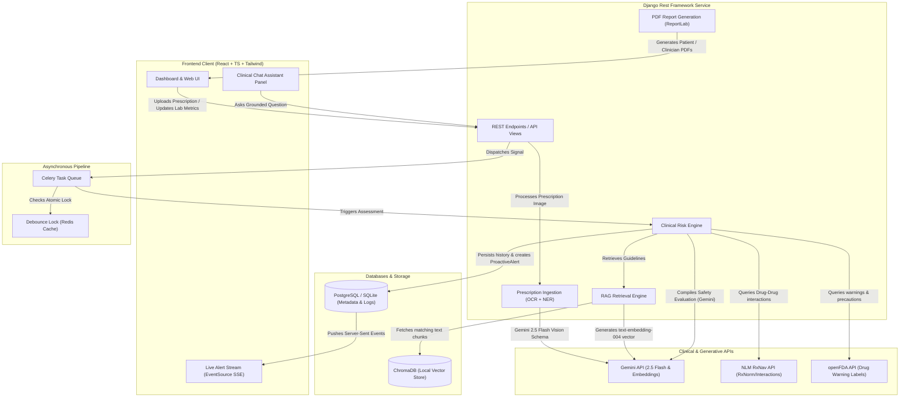

# 🛡️ MedGuardian AI — Proactive Medication Digital Twin

MedGuardian AI is a portfolio-grade clinical decision support (CDS) platform designed as a proactive **Medication Digital Twin**. It helps patients and clinicians monitor medication safety by continuously auditing health profiles, drug combinations, and renal capabilities against active clinical guidelines and real-time drug databases. 

The system leverages multimodal AI vision for prescription ingestion, a local Vector Database (ChromaDB) for Retrieval-Augmented Generation (RAG) of medical guidelines, and an asynchronous Celery task pipeline to react instantly to updates in the patient's medical profile.

---

## 📐 System Architecture

The following diagram illustrates how the frontend client, Django REST Framework, Celery worker queue, databases, and external clinical APIs orchestrate to deliver proactive safety alerts:



---

## 🌟 Core Features

### 1. 📸 Ingestion Pipeline (OCR & Medical NER)
*   **Multimodal Parsing**: Upload prescription scans or smartphone photos directly to the portal.
*   **Structured Output**: Integrates `google-genai` and `gemini-2.5-flash` with a strict Pydantic JSON schema (`ExtractionResult`) to parse raw handwriting/prints into a structured list of medications, strengths, dosages, and frequencies.
*   **Offline/No-Key Fallback**: In the absence of a `GEMINI_API_KEY`, the pipeline gracefully falls back to a mock parser parsing typical hypertension/antibiotic prescriptions to allow local developer testing.

### 2. 🧠 Retrieval-Augmented Generation (RAG)
*   **Guideline Embedding**: Custom indexing management command chunking and indexing PDF/TXT files in a local `ChromaDB` using Gemini's `text-embedding-004`.
*   **Semantic Evidence Retrieval**: Automatically searches local guidelines for context matching patient circumstances (e.g. pregnancy, low kidney function, specific allergy reactions).
*   **Keyword Search Fallback**: Automatically switches to a localized TF-IDF-like keyword search if the API key is missing or offline, ensuring local functionality.

### 3. ⚡ Clinical Decision Support (CDS) Risk Engine
*   **Drug ID Resolution**: Maps generic names to unique RxNorm Concept Unique Identifiers (RxCUI) using the National Library of Medicine (NLM) RxNav API.
*   **Drug-Drug Interaction Audits**: Queries the NLM REST API for clinical drug interactions, falling back to a curated set of local rules (e.g. Lisinopril + Spironolactone hyperkalemia warning) in offline environments.
*   **Multi-Factor Safety Evaluation**: Combines demographics (age, gender, pregnancy), lab metrics (Creatinine, eGFR), documented allergies, and active medications. Uses Gemini 2.5 Flash to synthesize clinical alerts grounded strictely in retrieved RAG guidelines.

### 4. 🔔 Proactive Alerting & Celery Pipeline
*   **Digital Twin Synchronization**: Django post-save signals listen to changes in `PatientProfile` (lab metrics, allergies, conditions) and `MedicationCabinet` (added, edited, or deactivated medications).
*   **Asynchronous Auditing**: Signals trigger background Celery tasks that re-evaluate patient safety out-of-process.
*   **Idempotency & Debouncing**: Implements a 10-second atomic cache-based lock to collapse rapid duplicate actions (e.g., editing multiple cabinet fields consecutively) into a single analysis run.
*   **Worsening Risk Detection**: Compares the new risk score (`Safe`, `Low`, `Moderate`, `Severe`) with the previous assessment. If the risk level escalates, it automatically publishes a `ProactiveAlert`.
*   **Fault-Tolerant Retries**: Retries external API outages using exponential backoff (up to 3 times).

### 5. 📡 Live Alert Streaming (SSE)
*   **Server-Sent Events**: The backend exposes an HTTP `text/event-stream` endpoint pushing unacknowledged safety alerts to the client instantly.
*   **Fallback Polling**: The React `useAlerts` hook initiates SSE connections and automatically falls back to standard REST HTTP polling if connections fail or are blocked.

### 6. 📄 Dynamic PDF Report Generation
*   **Patient Safety Summary**: A clean, plain-language PDF report explaining active medications, schedules, and safety considerations.
*   **Clinician Safety Dossier**: A high-density, professional report detailing demographic data, lab logs, specific drug warning profiles, clinical mechanisms, and indexed references for pharmacists or physicians.

---

## 🛠️ Technology Stack

| Layer | Technologies | Description |
|---|---|---|
| **Backend Core** | Python 3.10+, Django 4.2.x, Django REST Framework | MVC core API endpoints, Model structure, and views |
| **Authentication** | djangorestframework-simplejwt (JWT) | Secure stateless token authentication |
| **Generative AI** | `google-genai` SDK, `gemini-2.5-flash`, `text-embedding-004` | Multimodal OCR, RAG embedding, and clinical synthesis |
| **Vector Database** | ChromaDB | Local vector store hosting clinical guidelines |
| **Task Queue** | Celery 5.3.x, Redis | Asynchronous pipeline, retry worker, and debouncer |
| **Reports** | ReportLab, pypdf | PDF document rendering & PDF guideline text parsing |
| **Frontend Core** | React 18, Vite 8, TypeScript | Single-Page Application client architecture |
| **Styling** | Tailwind CSS | Utility-first styling with sleek dark-mode glassmorphic theme |
| **Visualization** | Recharts, Lucide React | Risk history timeline charting and vector icons |

---

## 📁 Repository Structure

```
MedGuardian_AI/
├── backend/                       # Django Backend Project
│   ├── manage.py                  # Django CLI entrypoint
│   ├── accounts/                  # User accounts registration & endpoints
│   ├── patients/                  # Profile, Cabinet, Celery Tasks, & SSE Alerts
│   ├── prescriptions/             # Prescription upload, processing, & OCR
│   ├── evidence/                  # Evidence models & guidelines index commands
│   ├── services/                  # Core RAG, Ingestion, Risk, & Report engines
│   │   ├── ingestion.py           # Prescription OCR parsing logic
│   │   ├── rag.py                 # ChromaDB vector retrieval & openFDA client
│   │   ├── risk_engine.py         # Multi-factor CDS risk scoring
│   │   └── reports.py             # ReportLab PDF design and generation
│   ├── medguardian/               # Core configurations and settings
│   ├── data/                      # Raw guideline TXT/PDF storage
│   └── requirements.txt           # Backend dependencies
├── frontend/                      # React Frontend Project
│   ├── src/
│   │   ├── components/            # UI components (Upload, Review, Chat)
│   │   ├── pages/                 # Views (Dashboard, History, Login)
│   │   ├── hooks/                 # Custom React hooks (useAlerts)
│   │   ├── App.tsx                # Client Routing and layout entrypoint
│   │   └── main.tsx               # DOM initialization
│   ├── package.json               # Frontend dependencies & scripts
│   └── vite.config.ts             # Vite configurations
├── redis-win/                     # Portable Redis binaries for Windows
├── docker-compose.yml             # Orchestration for containerized execution
└── start-dev.ps1                  # Powershell local development startup script
```

---

## 🚀 Local Development Setup

### Prerequisites
*   **Python**: Version 3.10 or 3.11 recommended.
*   **Node.js**: Version 18+ recommended (with npm).
*   **PowerShell**: For running the automated startup script on Windows.

### 1. Environment Configuration
Create a `.env` file in the root directory:
```bash
cp .env.example .env
```
Fill in the parameters (the app will run in mock mode if `GEMINI_API_KEY` is left blank):
```ini
DEBUG=True
SECRET_KEY=your-dev-secret-key
DATABASE_URL=postgres://postgres:postgres@db:5432/medguardian # Used by Docker, falls back to local sqlite3 for local dev
GEMINI_API_KEY=AIzaSy... # Your Google Gemini API Key
```

### 2. Seeding Clinical Evidence (RAG Vector Store)
Add clinical guides (PDFs or TXT files) to the `backend/data/` folder. A placeholder `who_guidelines.txt` is provided.
Run the ingestion command to parse and index documents in ChromaDB:
```bash
cd backend
python manage.py migrate
python manage.py ingest_evidence
```

### 3. Startup Options

#### Option A: Interactive Dev Script (Recommended)
On Windows, run the dev startup script in PowerShell:
```powershell
./start-dev.ps1
```
This script automatically:
1. Detects and starts Redis locally (looks on PATH, common Program Files directories, or within `./redis-win/`).
2. Runs the Django backend development server at `http://localhost:8000`.
3. Launches the Celery worker queue in `async` mode (or fallback to `eager` inline mode if Redis is missing).
4. Runs the React client web server at `http://localhost:5173`.

#### Option B: Manual Execution
If not using the startup script, start the services in separate terminal windows:

*   **Redis**: `redis-server`
*   **Django Server**: 
    ```bash
    cd backend
    python manage.py runserver
    ```
*   **Celery Worker**:
    ```bash
    cd backend
    celery -A medguardian worker --loglevel=info -P solo
    ```
*   **Vite Frontend**:
    ```bash
    cd frontend
    npm install
    npm run dev
    ```

#### Option C: Containerized Execution (Docker)
Run the entire stack in isolated Docker containers:
```bash
docker-compose up --build
```
*Make sure Docker Desktop is active and `GEMINI_API_KEY` is exported in your terminal session.*

---

## 🧪 Testing and Verification

MedGuardian AI has an integration and unit testing suite.
To execute all backend tests (including the Stage 2 end-to-end signal and async task flow verification):

```bash
cd backend
python manage.py test
```

---

## 📡 API Endpoint Reference

### Authentication
*   `POST /api/auth/register/` — Create user and initialize patient profile. Returns JWT tokens.
*   `POST /api/auth/token/` — Obtain access and refresh JWT tokens.
*   `POST /api/auth/token/refresh/` — Refresh access token.

### Patient Profile & Clinical Digital Twin
*   `GET /api/patients/profile/` — Fetch current patient profile (age, gender, chronic diseases, eGFR, Creatinine, allergies).
*   `PUT/PATCH /api/patients/profile/` — Update profile properties. *Triggers background Celery safety re-evaluation.*
*   `GET /api/patients/profile/safety-check/` — Run an immediate, synchronous evaluation of medication safety.
*   `POST /api/patients/profile/chat-ask/` — Post a natural language medical query. Answers are grounded in the ChromaDB guidelines using RAG.
*   `GET /api/patients/profile/report-patient/` — Download plain-language safety PDF report.
*   `GET /api/patients/profile/report-clinician/` — Download high-density clinical summary PDF report.
*   `GET /api/patients/me/safety-history/` — Fetch historical safety timeline data (up to 50 runs) for graphing.

### Medication Cabinet
*   `GET /api/patients/cabinet/` — List all medications in the patient's cabinet.
*   `POST /api/patients/cabinet/` — Add a new medication (name, dosage, frequency, start date). *Triggers background Celery safety re-evaluation.*
*   `PUT/PATCH /api/patients/cabinet/{id}/` — Modify or deactivate cabinet medication. *Triggers background Celery safety re-evaluation.*
*   `DELETE /api/patients/cabinet/{id}/` — Delete cabinet medication. *Triggers background Celery safety re-evaluation.*

### Prescriptions & Ingestion
*   `POST /api/prescriptions/upload/` — Upload a prescription scan. Triggers OCR + NER parsing. Returns recognized medications.
*   `POST /api/prescriptions/{id}/confirm/` — Confirm extracted medications, transferring selected items to the medication cabinet. *Triggers background Celery safety re-evaluation.*

### Proactive Alerts
*   `GET /api/alerts/unread/` — Fetch list of unacknowledged proactive safety alerts.
*   `POST /api/alerts/{id}/acknowledge/` — Acknowledge/dismiss a safety alert.
*   `GET /api/alerts/stream/` — Server-Sent Events (SSE) live push stream. Sends `{alerts: [...], count: N}` frames.

---

> [!WARNING]
> **Clinical Safety Notice & Disclaimer**
> MedGuardian AI is an educational clinical decision support tool designed to assist with medication safety. It is **NOT** a diagnostic device, does not provide medical treatment, and should **never** replace professional consultation with a qualified pharmacist or physician. Always cross-reference medication details with physical pharmacy labels and consult a physician before modifying drug regimens.
